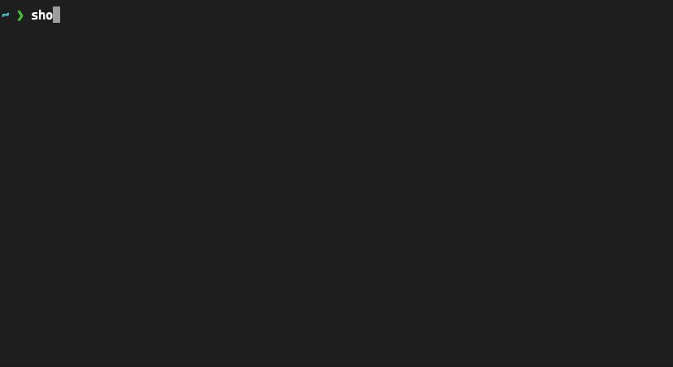

# Shopify Webhook Commander



## Installation

🚫 This package is under active development; installer beware.

```sh-session
$ npm i -g shopify-webhook-commander
```

## Example

```sh-session
$ shopify-webhook-commander config:set
  > Shop (with .myshopify.com): tbeseda.myshopify.com
  > Password: ****************

$ shopify-webhook-commander webhook:create
  > Webhook topic: ORDERS_CREATE
  > Callback URL: https://ingest.my-app.com/
  Created gid://shopify/WebhookSubscription/1021513859211 for "tbeseda"

$ shopify-webhook-commander webhook:list
  Webhooks for "tbeseda"
    Topic          Endpoint                   ID
    ────────────── ────────────────────────── ───────────────────────────────────────────────
    SHOP_UPDATE    https://ingest.my-app.com/ gid://shopify/WebhookSubscription/1021513859211

$ shopify-webhook-commander webhook:delete
  > Webhook id to delete: gid://shopify/WebhookSubscription/1021513859211
  Deleted gid://shopify/WebhookSubscription/1021513859211 from "tbeseda"
```

## Shopify Webhook Topics

This tool uses the Shopify Admin GraphQL API. Webhook subscription topics should be of type [WebhookSubscriptionTopic](https://shopify.dev/api/admin/graphql/reference/events/webhooksubscriptiontopic)

## Note about auth tokens

This tool uses a single token to authenticate; this is easiest with a Shopify "Private" Admin App. Set the config secret to the private app password. _There is no OAuth flow to help with "Custom" Partner apps._
In theory, you can instead provide an `accessToken` acquired from a Custom app's authentication flow. I haven't tested this.
`shopify-webhook-commander` doesn't really help for "Public" apps that typically manage webhooks for each shop install programatically.

## Roadmap

1. tests 😬
1. replace Apollo client with a slimmer GQL lib
1. integrate `@shopify/shopify-api` types -- gotta get rid of those `any` types
1. `webhooks:update` command
1. autocomplete webhook topics
1. auth loop for custom apps

---

# `oclif` Generated Docs:

The section below is auto-generated by `oclif` upon package release.

## shopify-webhook-commander

Set up Shopify webhook subscriptions from the command line

[](https://oclif.io)
[](https://npmjs.org/package/shopify-webhook-commander)
[](https://npmjs.org/package/shopify-webhook-commander)
[](https://github.com/tbeseda/shopify-webhook-commander/blob/master/package.json)

<!-- toc -->

- [Shopify Webhook Commander](#shopify-webhook-commander)
- [`oclif` Generated Docs:](#oclif-generated-docs)
- [Usage](#usage)
- [Commands](#commands)
<!-- tocstop -->

# Usage

<!-- usage -->

```sh-session
$ npm install -g shopify-webhook-commander
$ shopify-webhook-commander COMMAND
running command...
$ shopify-webhook-commander (-v|--version|version)
shopify-webhook-commander/0.2.0 darwin-arm64 node-v16.4.1
$ shopify-webhook-commander --help [COMMAND]
USAGE
  $ shopify-webhook-commander COMMAND
...
```

<!-- usagestop -->

# Commands

<!-- commands -->

- [`shopify-webhook-commander config:reveal`](#shopify-webhook-commander-configreveal)
- [`shopify-webhook-commander config:set`](#shopify-webhook-commander-configset)
- [`shopify-webhook-commander config:unset`](#shopify-webhook-commander-configunset)
- [`shopify-webhook-commander help [COMMAND]`](#shopify-webhook-commander-help-command)
- [`shopify-webhook-commander webhooks:create`](#shopify-webhook-commander-webhookscreate)
- [`shopify-webhook-commander webhooks:delete`](#shopify-webhook-commander-webhooksdelete)
- [`shopify-webhook-commander webhooks:list`](#shopify-webhook-commander-webhookslist)

## `shopify-webhook-commander config:reveal`

print current Shopify config

```
USAGE
  $ shopify-webhook-commander config:reveal

OPTIONS
  -h, --help  show CLI help
  -y, --yes   agree to reveal
```

_See code: [src/commands/config/reveal.ts](https://github.com/tbeseda/shopify-webhook-commander/blob/v0.2.0/src/commands/config/reveal.ts)_

## `shopify-webhook-commander config:set`

set Shopify credentials config

```
USAGE
  $ shopify-webhook-commander config:set

OPTIONS
  -h, --help       show CLI help
  --secret=secret
  --shop=shop
```

_See code: [src/commands/config/set.ts](https://github.com/tbeseda/shopify-webhook-commander/blob/v0.2.0/src/commands/config/set.ts)_

## `shopify-webhook-commander config:unset`

remove Shopify config

```
USAGE
  $ shopify-webhook-commander config:unset

OPTIONS
  -h, --help  show CLI help
```

_See code: [src/commands/config/unset.ts](https://github.com/tbeseda/shopify-webhook-commander/blob/v0.2.0/src/commands/config/unset.ts)_

## `shopify-webhook-commander help [COMMAND]`

display help for shopify-webhook-commander

```
USAGE
  $ shopify-webhook-commander help [COMMAND]

ARGUMENTS
  COMMAND  command to show help for

OPTIONS
  --all  see all commands in CLI
```

_See code: [@oclif/plugin-help](https://github.com/oclif/plugin-help/blob/v3.2.2/src/commands/help.ts)_

## `shopify-webhook-commander webhooks:create`

create a webhook subscription

```
USAGE
  $ shopify-webhook-commander webhooks:create

OPTIONS
  -h, --help                 show CLI help
  --callbackUrl=callbackUrl
  --topic=topic
```

_See code: [src/commands/webhooks/create.ts](https://github.com/tbeseda/shopify-webhook-commander/blob/v0.2.0/src/commands/webhooks/create.ts)_

## `shopify-webhook-commander webhooks:delete`

delete a webhook given a resource id

```
USAGE
  $ shopify-webhook-commander webhooks:delete

OPTIONS
  -h, --help  show CLI help
  --id=id
```

_See code: [src/commands/webhooks/delete.ts](https://github.com/tbeseda/shopify-webhook-commander/blob/v0.2.0/src/commands/webhooks/delete.ts)_

## `shopify-webhook-commander webhooks:list`

list existing shop webhook subscriptions

```
USAGE
  $ shopify-webhook-commander webhooks:list

OPTIONS
  -h, --help  show CLI help
```

_See code: [src/commands/webhooks/list.ts](https://github.com/tbeseda/shopify-webhook-commander/blob/v0.2.0/src/commands/webhooks/list.ts)_

<!-- commandsstop -->
